# Adpative Replacement Cache (ARC)

## 前言
最近参与了组内的缓存设计讨论，最后他们选用了Adpative Replacement Cache (ARC)作为缓存的淘汰算法。虽然轮不到我这种菜鸟实现设计，但出于好奇，还是把这篇2003年的IBM文章读了，并在此记录一下笔记。论文题目是《ARC: A Self-Tuning, Low Overhead Replacement Cache》，[论文地址](https://www.usenix.org/conference/fast-03/arc-self-tuning-low-overhead-replacement-cache)。

## 导读

论文前部分对常用的缓存淘汰算法进行了分类和讨论，我这里也简单记录一下。（方便以后面试问到缓存淘汰算法，不只会说LRU和LFU，嘻嘻~）
### Recency
基于最近访问策略的淘汰算法，著名的就是LRU策略了，也是校招面试经常问到和手撕的算法。
* 优点：实现简单；适合有局部特性的数据。
* 缺点：1.不能防止有scan特性的数据。2.不适合那些访问频率分布不一的数据。

### Frequency

基于访问频率的淘汰算法，有LFU、LRU-2、2Q、LIRS。

LFU：
* 优点：捕获了频率信息。
* 缺点：1.实现复杂，需记录page的访问次数便于淘汰缓存，一般用到优先队列来保存该信息，有log(n)的时间复杂度。2.没有捕获数据历史的访问信息。3.若某些过期的page有较高的访问频率，会一直得不到安慰的淘汰~

LRU-2：核心思想是记录page的最后两次访问时间，需淘汰时，根据page倒数第二次访问时间作为最近没被访问的依据进行淘汰。
* 优点：既有频率信息，也有最近访问的信息。
* 缺点：1.仍需要优先队列记录page的访问次数，有log(n)的时间复杂度。2.需要调整一个参数Correlated Information Period (CIP), 论文说的是that roughly captures the amount of time a page that has only been seen once recently should be kept in the cache. 我个人的理解是：在缓存中划出多大的区域，用于保存那些最近只被访问了一次的page。该值越小，访问频率较高的page不易被淘汰；值越大，则越像LRU。

2Q：核心思想类似LRU-2，由一个fifo（A1）和一个lru_list（Am）组成，降低了实现LRU-2的时间复杂度。大概看了下2Q的论文，他们发现了一种常见的workload：一个新的page被加载到缓存后，短时间内会被多次访问，但过了一段时间有可能不会再被访问也有可能被继续访问，若是被继续访问，说明这是个值得长期保存的page。所以他们把fifo划分成了A1in和A1out，A1in存放首次访问的page，A1out保留从A1in中淘汰的page的索引。若一个新pageA首次加载被放入A1in中时，由于在短时间内会被多次访问，所以即使在fifo队列中，也不会那么容易被淘汰。若一段时间后，pageA被淘汰了，索引保存在A1out的索引中，然后又过了一段时间，发现pageA再次被访问，则说明该page是个会被长期访问的page，就会把pageA加载到Am上，后续访问pageA能在Am直接命中，且将其移至Am头部，确保不易被淘汰。

* 优点：降低了LRU-2的实现复杂度。
* 缺点：还是需要调参，有两个参数Kin和Kout。Kin表示A1in的大小，有点像CIP；Kout表示A1out的大小。
* 具体流程图如下：

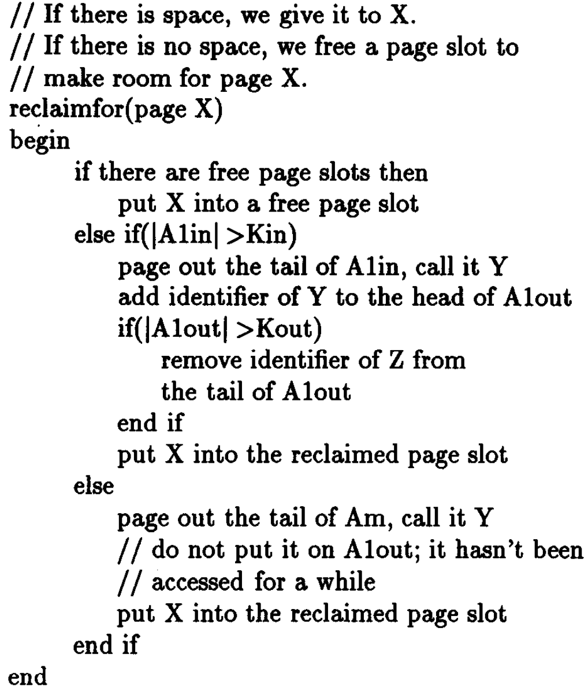

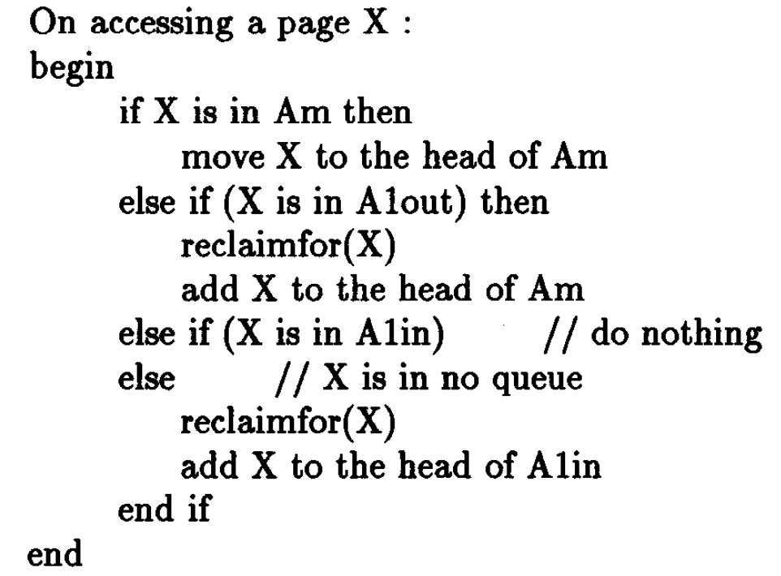

LIRS：Low Inter-refernce Recency，缓存被分为至少访问两次的page和最近只访问一次的page，用栈保存至少被访问了两次的page。具体细节可参考[此文](https://www.jianshu.com/p/13282263339c)。
* 缺点：1.需要调整参数。2.在最坏情况下需要栈剪枝，时间复杂度不是常数。3.要限制栈的大小。

### Recency and Frequency
最近访问信息和频率信息全都要的策略。FBR、LRFU、ALRFU。
FBR：Frequency-based replacement policy。将lru_list分为new，middle和old三部分，同时也有count计数。当cache命中时，若该page在list的middle和old部分，则将count++和将page移动到new的MRU部分（lru的头部）；若cache命中且page在new部分，则只移动page至MRU，但不增加计数。需淘汰page时，从old部分选择count最小的page淘汰。为什么cache在new部分命中时不增加计数，个人理解是为了减少那些短时间内被多次访问的page一直占据着高count，影响淘汰。

* 优点：结合了频率和最近访问策略
* 缺点：1.需要合理分配lru_list中三部分的大小（需调参）。2.为了防止那些已过期但count较高的page一直占据着cache，需定时调整cache中的counts。

LRFU： Least Recently/Frequently Used (LRFU)。在cache中的page按以下公式（指数平滑？）调整权重，淘汰时按权重最小的page淘汰。从公式可知，当指数为0时，表现得像LFU；当指数为1时，最近未被访问的page权重会不断下降，表现得则像LRU。

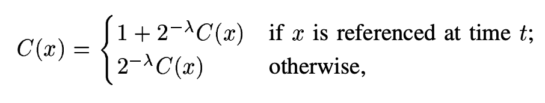

* 优点：结合了频率和最近访问策略。
* 缺点：1.需合理调整指数这个参数。2.实现复杂和耗时，可能有log(n)的耗时（每次取最小值）。

ALRFU： Adaptive LRFU，动态调整LRFU中的指数。

### Temporal Distance Distribution

基于page访问时间间隔的淘汰策略，有MQ。

MQ：通过mulit-queue来实现。该策略用了多级队列，每个队列保存被访问了一定次数的page。当cache命中时，对应page就增加访问频率，并且移到合适的队列上，该page还被记录上一个过期时间*expireTime*，该时间等于*currentTime* + *lifeTime*。每次访问都会去看各队尾的page是否超时了，超时了就移动到下一级的队列中。这个*lifeTime*便代表每个page被访问的时间间隔。

* 缺点：虽*lifeTime*这个参数可以根据page访问的间隔动态调整，但整体实现复杂，较为耗时。

### Caching using Multiple Experts

专家模型master-policy，内部实现各种淘汰策略，每次动态选择其中一种策略，具体选择标准可看相关论文，有点像机器学习中的模型融合？。

* 优点：集大成者。
* 缺点：复杂、耗时。

### Ghost Caches

Ghost list记录被淘汰page的信息，根据在Ghost list的命中率调整淘汰策略，在2Q、MQ、LRU-2、ALRFU和LIRS都有用到。

### 小结

* LRU-2、2Q、LIRS、FBR和LRFU算法需事先调整好相关参数。ARC、ALRFU和MQ可根据workload动态调整参数。
* LFU和FBR需要定期调整cache中的counts，防止曾高频访问的page占据cache空间。ARC不需要。
* LIRS的实现需要大量空间消耗。ARC不需要。
* 对比MQ，ARC有更小时间开销和更快的调整响应。
* ARC、2Q、LIRS、MQ和FBR的实现是常数时间复杂度，LFU、LRU-2和LRFU是对数时间复杂度。

## 初步探索DBL

接着我就按自己对论文的理解与思考，分析ARC的产生。

从上述导读可知，传统LRU策略对最近访问的数据有很好的缓存效果。但这些最近经常被访问的数据，其实有着较高的访问频率，过一段时间后极有可能再次被访问，但是由于在一段时间这些数据没被访问过，很可能就被缓存淘汰，所以传统LRU策略没有很好捕获到这些频率信息。假设cache大小c=3，若使用传统LRU，依次访问[1,1,1,2,3,4]序列，当访问到数据4时，会把数据1淘汰了。但其实数据1在短时间被访问了多次，后续极有可能再次被访问，如序列可能为[1,1,1,2,3,4,1,1,1]。

假设我们拥有两倍的cache，即有两个大小相同的lru_list。一个为L1，用来存放首次访问的数据；另一个为L2，用来存放至少访问了两次的数据。那么访问上述序列时，两个列表就如图1所示，后续数据1若想被访问，可直接从L2命中。

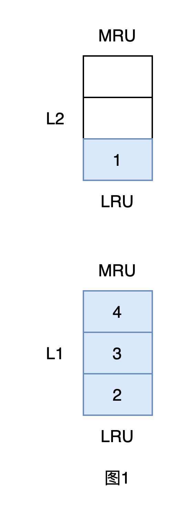

这样双倍cache的设计，有些需要注意的点，如图2所示，L1和L2都满了，若此时需要访问数据6，可有两种处理情况：

* 情况1：淘汰L2的数据1，将L1的数据6移至L2；这样L1空出一个cache块。
* 情况2：将数据6移至L2，此时L2长度为4，L1长度为2。

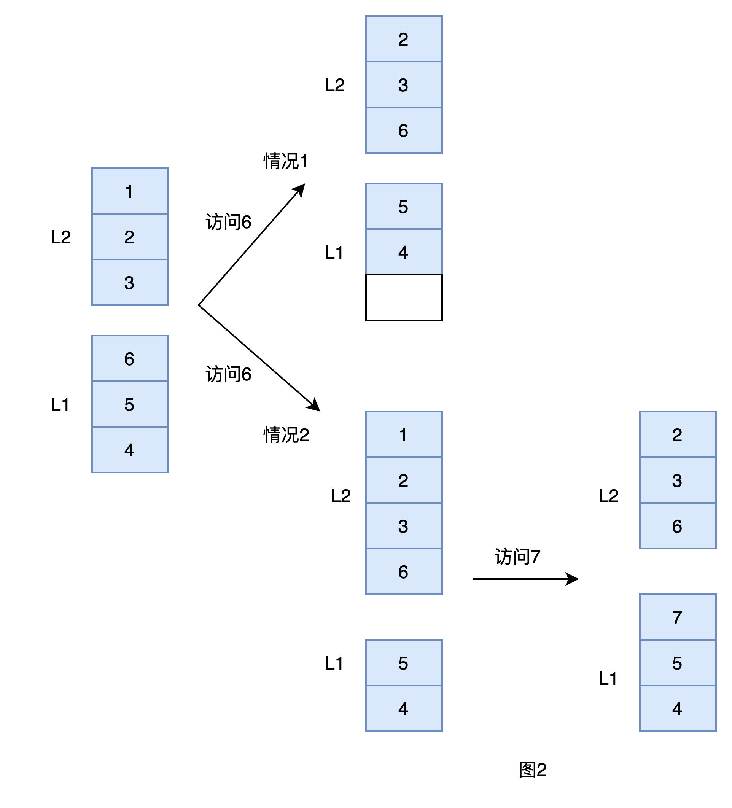

若选择了情况1，不仅浪费了cache空间，而且在L2中的数据是曾被访问多次的，数据1很有可能后续再次被访问，所以可以选择保留，因此选择情况2处理是比较适合的。但要注意这里L2的长度会增加，最长可能是6，L1的长度会减小，最小为0。在选择了情况2后，若出现首次访问的数据，如数据7，则需从L2中将数据1淘汰了，以便维持L1的长度为3。为什么这里不从L1淘汰数据呢？因为L1设定的本质是记录c个最近只出现一次的数据，即使L1长度减为0，L1也符合这个设定。但若出现首先访问的新数据，且L1长度不足c时，则需要从L2淘汰数据以满足该设定。同样正是因为这个设定，我们看看下图3的情况，若L1长度已为3，此时访问数据7，应该走情况2从L1中淘汰数据4，不应偷走L2的空间。

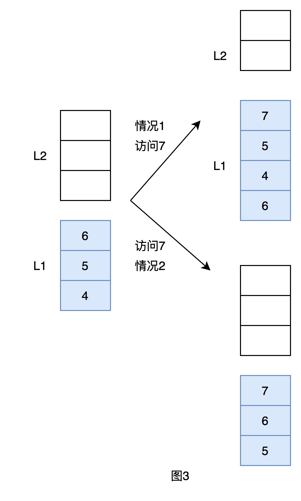

上述分析完，大体就是论文中DBL的设计，数据结构和算法步骤如下：

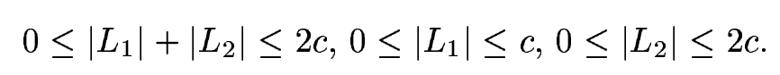

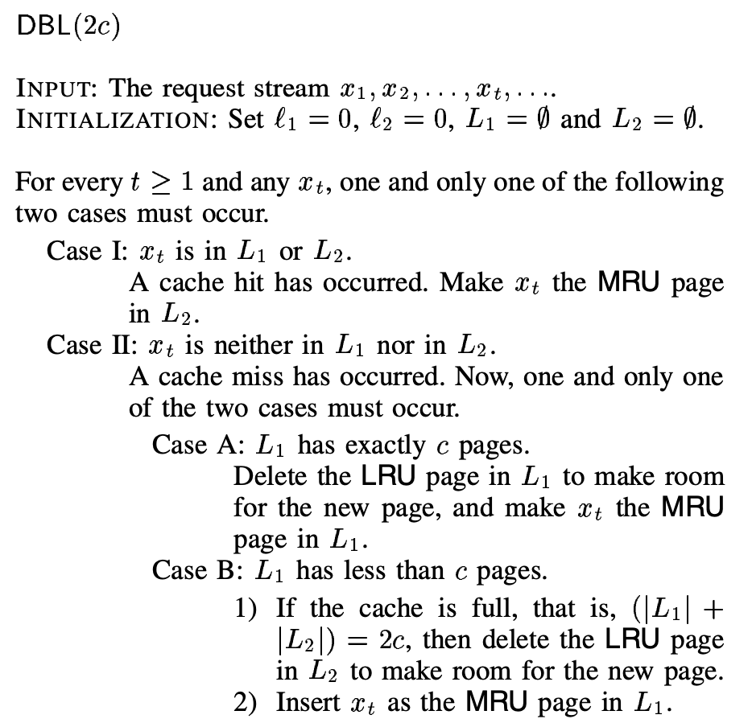

## 终章ARC

DBL的设计看似十分美好，既能很好缓存最近访问的数据，还能将频繁被访问数据保存在L2中，不容易被淘汰。但是该设计用到了两倍cache。倘若我们只有c大小的cache，那该如何设计？

既然只有c大小的cache，那么直接设L1长度为p，L2长度为c-p就好了。但是这样设计，L1和L2的长度都大大减少了，远远达不到DBL的效果。所以可以在原来DBL的设计中，从L1选择p个最近访问数据，从L2选择c-p个最近访问数据，最终组成c个cache，而在L1和L2中超过p和c-p的部分会被淘汰。虽然淘汰了其数据内容，但可记录其索引如key之类作为历史淘汰信息。因此ARC把L1分为了T1和B1，把L2分为了T2和B2。只有T1和T2实际缓存数据内容，两者长度相加最大为c，B1和B2保存着从T1和T2的历史淘汰信息，两者相加最大也为c。那么这些历史信息有什么用途呢？个人认为有两个：

* 第一：在DBL中，是认为B1和B2的数据依然缓存着，但ARC是迫于钱包太小给淘汰掉了。所以当访问命中这些历史淘汰信息时，说明这些数据还是有一定访问频率的，只是之前钱包装不下给淘汰掉了，于是可将这些数据重新加载，并放到L2的最前头中，使其不再易被淘汰。
* 第二：可根据命中历史淘汰信息，动态调整p值。

这里再谈谈p值。若p值固定，就是论文所讲的FRC。若根据workload动态调整p值，就是ARC了。这个p值决定了当缓存没命中，即遇到首次访问的数据时，是否从T1中淘汰数据块。若目前T1长度小于p，说明还没记录够p个最近只访问一次的数据，于是从T2淘汰数据块至B2，T1长度增加（参数上节图2访问数据7）。若目前T1长度大于等于p（若p值固定，理论是不会大于p的）则直接从T1替换数据块，被替换的数据块下层至B1，T1长度不变。

再谈谈历史淘汰信息，其实可将ARC的T1看作是一个记录数据频度的真实窗口，若在该窗口内，数据短时间再被访问，可认为该数据有访问频度，将其移至T2中。所以当数据命中了B1时，说明当前的窗口太小了，若窗口够大，钱包够厚，我能缓存住该数据，就不用重新加载了，于是可考虑增加p值；若数据命中了B2，说明当前的workload倾向于访问有频度的数据，所以可缩小窗口以便有更多容量缓存这些频度数据，于是可考虑减少p值。

在我看来，ARC是利用c大小的cache来希望能有DBL类似的效果。论文中数据结构和流程图如下：

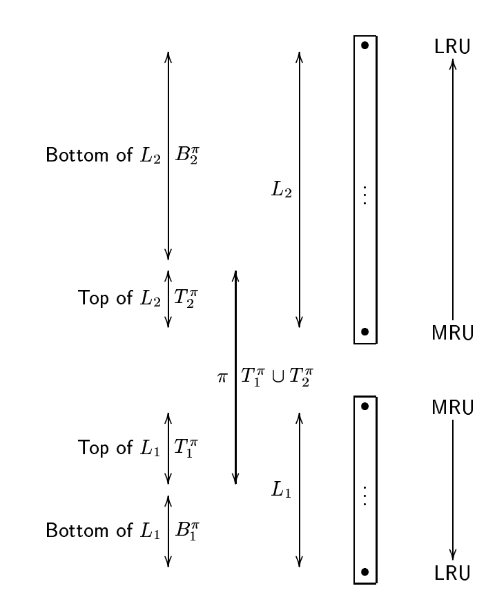

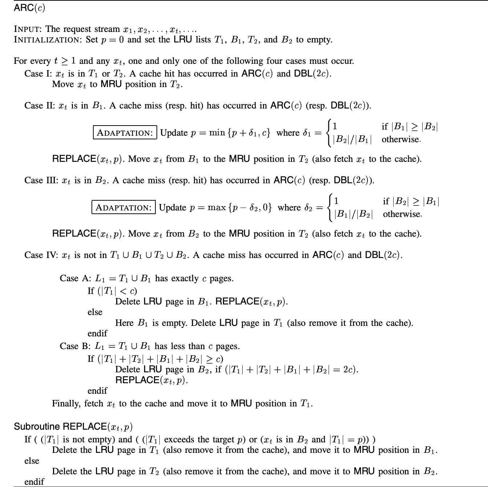

这里值得注意的是，在论文中，若数据命中B1，p增加的大小根据B1和B2的长度会有所不同。为什么有不同，个人猜测是这样的：若B1长度大于等于B2，由于B1已缓存了较多（相对于B2）历史淘汰的信息，所以p值调整策略不用那么激进，增加1即可；若B2长度大于B1，说明B1已没多少空间去缓存历史淘汰信息了，所以需加大力度调整p值，用B2长度除以B1长度。对于命中B2的做法，也可这样猜测。

论文后续还提到了ARC有scan-resistant的特性。在理解了上述的讲解后，就很容易理解为什么有scan-resistant的特性。因为有scan特性的数据不会命中B1，p值不会增大，且只会不断淘汰T1中的数据块（限制了T1大小<=p），对T2中的数据没啥影响。

## 代码实现

Talk is cheap，show me the code。我用C++简单实现了一版ARC，如下图，跑了和论文相同的测试trace，得到了相同的cache命中率，[传送门](https://github.com/Xiaoccer/ARC_Cache)。具体就是用四个std::list模拟成T1、T2、B1和B2，然后根据论文说的步骤来实现即可。其中有个注意的点是：要达到和论文相同的命中率，p值要用浮点数去计算和比较。数据集的下载和使用方式可从IBM的网站中获取。

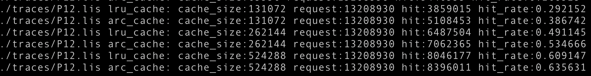

## 总结

最后总结一下我看完这篇论文的感想：

* 学习到了许多不同类型的缓存淘汰算法，以后面试要是问到相关内容可以多说几句，感觉比八股文要强点~
* 分析完ARC后，感觉传统的LRU策略其实是一条lru_list管理了最近访问的数据和有频率访问的数据，而ARC可看作将这条lru_list分成了两部分来管理，通过添加一些额外的小开销来保存历史淘汰信息，然后根据这些信息动态调整list两部分的长度。
* 抽象出来的一些架构设计思想：可利用少量开销记录部分数据的历史信息，并根据这些信息来分析当前系统的情况。
* 以上便是个人部分缓存淘汰算法和ARC的愚见，欢迎讨论与指导。